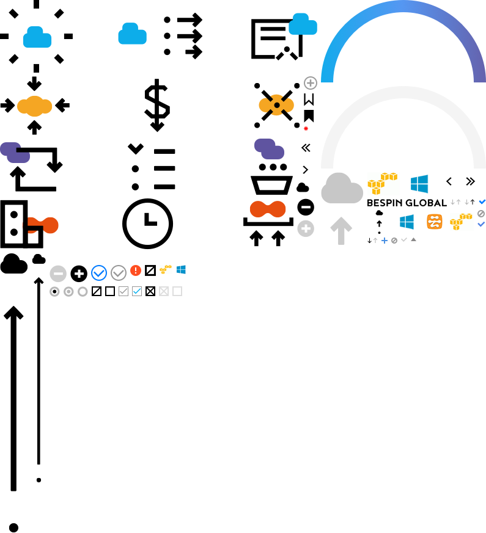

# BESPIN GLOBAL MARKUP GUIDE
베스핀 글로벌 HTML, CSS, JAVASCRIPT 가이드 문서입니다.

## 작업환경
  gulp로 자동화 작업을 추가하여 효율적인 리소스 관리와 작업 속도를 향상할 수 있습니다.

  - node
  - GIT
  - gulp(file include, sass, iconfont, image sprite, autoprefixer, csscomb)
  - SASS
  
## 시작
npm install 로 관련 모듈 다운로드 후, gulp build로 로컬 작업 시작
(node가 먼저 설치 되어있어야 합니다.)

```js
// 관련 모듈 다운로드
npm install

// 로컬 작업 시작
// /sources/build/ 폴더안의 내용이 localhost:9001 로 실행
gulp build

// 개발에 전달할 최종 파일이 /srouces/release/ 폴더에 생성
gulp release
```


## HTML 관련 모듈

* 파일 인클루드([gulp-file-include]) - /sources/html/includes 파일안의 개별 파일들을 인클루드해서 작성 할 수 있습니다.

```html
@@include('./head.html', {
	"lang": "en",
	"title": "Bespin Global"
})
<body class="portal">

	<!-- 상단 영역 -->
	<!-- asset, portal, metering, monitoring 파라미터값에 따라 개별 헤더로 표시 -->
	@@include('./header.html', {"service": "portal", "sub": ""})


	<!-- 본문 영역 -->
	<main>
		<article class="contents">
			<h1 class="title"><div class="inner">Manage Permissions</div></h1>
			<div class="contents-inner">
				커텐츠 영역
			</div>
		</article>
	</main>

	<!-- 하단 영역 -->
	@@include('./footer.html')
</body>
</html>
```
[gulp-file-include]: https://www.npmjs.com/package/gulp-file-include


## CSS 관련 모듈

- CSS 작성([SASS])
  - 모든 CSS는 SASS문법에 따라 .scss 파일로 작성되어 지고 bsd.scss를 기본으로 gulp에 의해서 모든 .scss 파일들은 bsd.css로 합쳐진 후 생성됩니다.
  - /srouces/assets/styles/scss/bsd.scss(다른 모든 scss파일들 import) ==> bsd.css

[SASS]: http://sass-lang.com/

- 스프라이트 이미지 생성([spritesmith])
  - /resources/images/sprites/*.png ==> sprites.png, sprites@2x.png 로 변환
  - 관련 css 속성들(background image url, position, size..)은 /sources/assets/styles/scss/_sprites.scss로 생성됩니다.
  - 
``` css
// scss
.iradio { display: block; position: absolute !important; top: 0; left: 0; @include retina-sprite($sc-runchecked-group);
	&.checked { @include retina-sprite($sc-rchecked-group);
		&.disabled { @include retina-sprite($sc-rchecked-disabled-group); }
	}
}

// bsd.css 로 자동 변환 후
.iradio {position: absolute !important; top: 0; left: 0;  display: block; width: 17px; height: 17px; background-image: url(../images/sprites.png); background-position: -359px -167px; }
@media (-webkit-min-device-pixel-ratio: 2), (min-resolution: 192dpi) { .iradio { background-image: url(../images/sprites@2x.png); background-size: 443px 458px; } }
.iradio.checked {width: 17px; height: 17px;  background-image: url(../images/sprites.png); background-position: -313px -167px; }
@media (-webkit-min-device-pixel-ratio: 2), (min-resolution: 192dpi) { .iradio.checked { background-image: url(../images/sprites@2x.png); background-size: 443px 458px; } }
.iradio.checked.disabled {width: 17px; height: 17px;  background-image: url(../images/sprites.png); background-position: -336px -167px; }
@media (-webkit-min-device-pixel-ratio: 2), (min-resolution: 192dpi) { .iradio.checked.disabled { background-image: url(../images/sprites@2x.png); background-size: 443px 458px; } }
```

[spritesmith]: https://github.com/Ensighten/spritesmith

- 폰트아이콘([gulp-iconfont], [gulp-iconfont-css])
  - /sources/assets/icons/*.svg ==> /sources/assets/fonts/icons/Icons.eot, Icons.ttf, Icons.woff 로 변환
  - 폰트 아이콘 관련 css 속성들은 /sources/assets/styles/scss/_icons.scss로 생성됩니다.
  - 아래 예제처럼 세팅 버튼에 아이콘 추가

``` css
/**
	buttons
**/
// settings - scss
.btn-settings { overflow: hidden; height: 21px; width: 21px;
	@include icon(settings); 
	&:before { display: block; height: 21px; width: 21px; font-size: 21px; color: #666; }
}

// bsd.css 로 자동 변환 후
/**
	buttons
**/
.btn-settings { overflow: hidden; width: 21px; height: 21px; }
.btn-settings:before { content: '\E01E'; }
.btn-settings:before {font-size: 21px;  display: block; width: 21px; height: 21px; color: #666; }
```

[gulp-iconfont]: https://www.npmjs.com/package/gulp-iconfont
[gulp-iconfont-css]: https://www.npmjs.com/package/gulp-iconfont-css


## JQEURY 관련 라이브러리
- [agGrid] - (enterprise)테이블 데이터
- [amChart] - 챠트
- [daterangepicker.custom.js] - 날짜 기간 선택 레이어
- [html5shiv.min.js] - IE 하위버전에서 HTML5 태그 인식
- [icheck.min.js] - input type[checkbox, radio] 커스텀 디자인 적용
- [jquery-confirm.min.js] - 커스텀 alert, confirm 창
- [jquery.cookie.js] - 쿠키 관련
- [jquery.magnific-popup.min.js] - 모달 팝업창
- [jquery.popupoverlay.js] - 툴팁 및 작은 레이어 팝업
- [jquery.selectric.js] - 커스텀 디자인 적용된 select tag
- [jquery.tablescroll.js] - agGrid를 제외한 테이블 형태의 tbody 스크롤
- [moment.min.js] - date format 처리
- [slick.min.js] - 이미지 슬라이드 관련
- [tooltipster.bundle.min.js] - popupoverlay.js 와 같은 기능(현재 모니터링에서만 사용함)

[agGrid]: https://www.ag-grid.com/
[amChart]: https://www.amcharts.com/
[daterangepicker.custom.js]: http://www.daterangepicker.com/
[html5shiv.min.js]: https://github.com/aFarkas/html5shiv
[icheck.min.js]: https://github.com/fronteed/iCheck/
[jquery-confirm.min.js]: http://craftpip.github.io/jquery-confirm/
[jquery.cookie.js]: https://github.com/carhartl/jquery-cookie
[jquery.magnific-popup.min.js]: http://dimsemenov.com/plugins/magnific-popup/documentation.html
[jquery.popupoverlay.js]: http://dev.vast.com/jquery-popup-overlay/
[jquery.selectric.js]: http://selectric.js.org/demo.html
[jquery.tablescroll.js]: http://www.farinspace.com/jquery-scrollable-table-plugin/
[moment.min.js]: http://momentjs.com/
[slick.min.js]: http://kenwheeler.github.io/slick/
[tooltipster.bundle.min.js]: http://iamceege.github.io/tooltipster/
